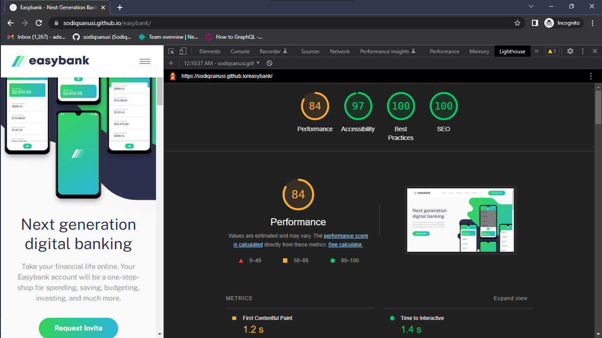

# Easybank landing page

This is a solution to the [Easybank landing page challenge on Frontend Mentor](https://www.frontendmentor.io/challenges/easybank-landing-page-WaUhkoDN). Frontend Mentor challenges help you improve your coding skills by building realistic projects. 

## Table of contents

- [Overview](#overview)
  - [The challenge](#the-challenge)
  - [Screenshot](#screenshot)
  - [Links](#links)
- [My process](#my-process)
  - [Built with](#built-with)
  - [What I learned](#what-i-learned)
  - [Continued development](#continued-development)
- [Author](#author)
- [Acknowledgments](#acknowledgments)

## Overview
The goal was to build a website for a banking solution, Easybank. The website is a simple landing page that talks about Easybank's services and is expected to be responsive across all screen sizes.

### The challenge

Users should be able to:

- View the optimal layout for the site depending on their device's screen size
- See hover states for all interactive elements on the page

### Screenshot

### Links

- Solution URL: [https://github.com/sodiqsanusi/easybank/](https://github.com/sodiqsanusi/easybank/)
- Live Site URL: [https://sodiqsanusi.github.io/easybank/](https://sodiqsanusi.github.io/easybank/)

## My process

To be honest, this was how I actually built this up
1. Sketched out the HTML structure of the site on paper.
2. Wrote the HTML code following the sketched-out structure.
3. Started styling for mobile/small screen devices.
4. Tweaked styles, then worked on functionalities.
5. Used Lighthouse tool to check for possible improvements, then tweaked things using the gotten feedback.
6. Made the site responsive for large screen devices.
7. Checked for improvements using Lighthouse tool again (There can always be improvements🤧)

### Built with

- Semantic HTML5 markup
- CSS custom properties
- Flexbox
- CSS Grid
- Mobile-first workflow

### What I learned

Actually built this to get back to the groove of creating interfaces, been doing algorithms mostly for a while. Can't really put my mind on a new thing I learnt while building this, although it was really fun building this nonetheless. 

### Continued development

Got a low rating on the performance of this site due to Content Layout Shift (CLS). Due to the fact that Next.js solves this issue by default, I don't really know much on how to prevent it in plain static websites. Will learn more on preventing CLS soon.

> (Totally unrelated) I want to get better in my animation skills!

## Author

- Frontend Mentor - [@sodiqsanusi](https://www.frontendmentor.io/profile/sodiqsanusi)
- Twitter - [@sodiqsanusi0](https://www.twitter.com/sodiqsanusi0)

## Acknowledgments
👀🤞🏾
